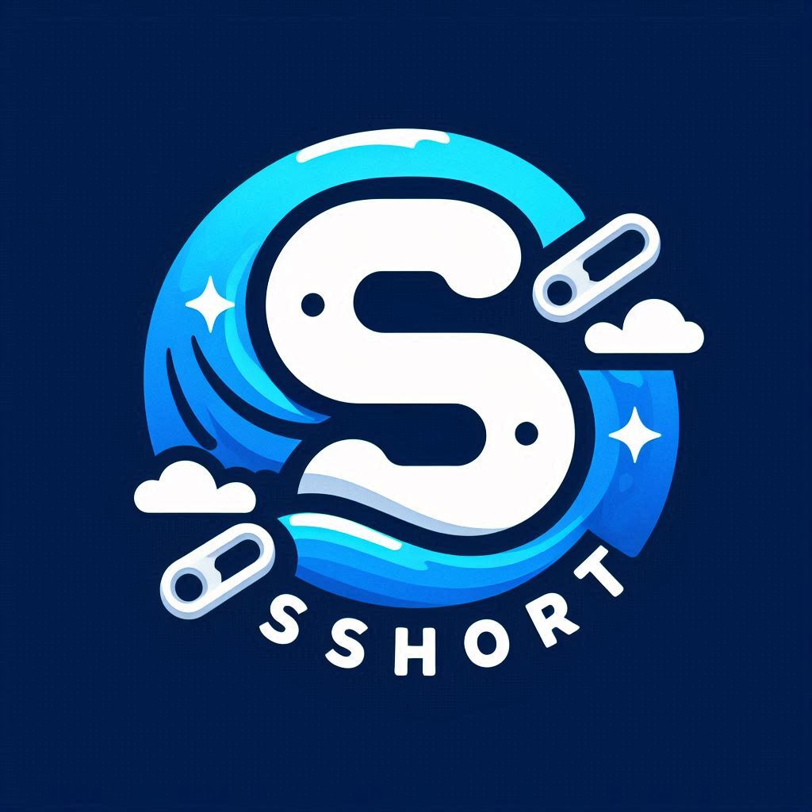

# SCShort

Logo created with Designer microsoft. AI

## What is SCShort?

SCShort is a url shortner inspired by *TinyUrl*, it uses ___Fiber___ and ***GoLang*** as a backend, as well as ***MongoDB*** and ***Redis*** for database solutions

## Tech Stack For the frontend:
- 
- 
- 
- 
- 

Hope you find this useful and feel free to add any contributions you find Relevant.

###### Created by Luis Fernando Cabral Tamayo - Scrabxd. © 2024.
